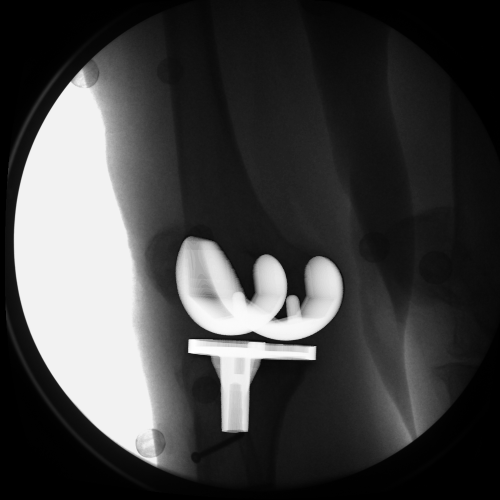
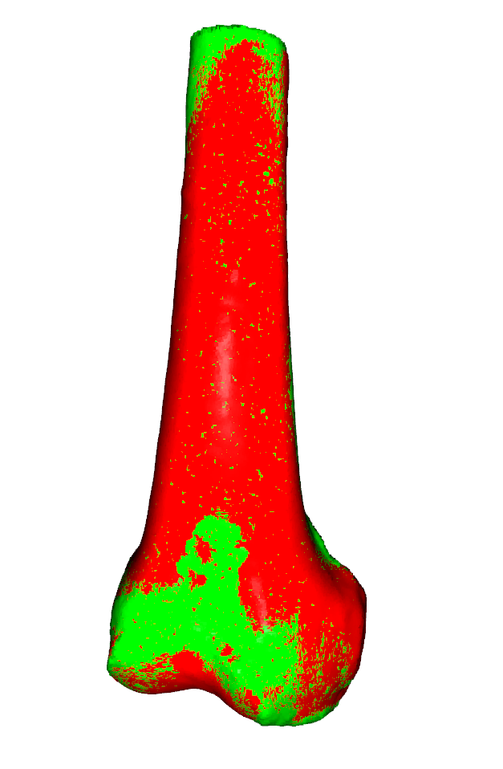
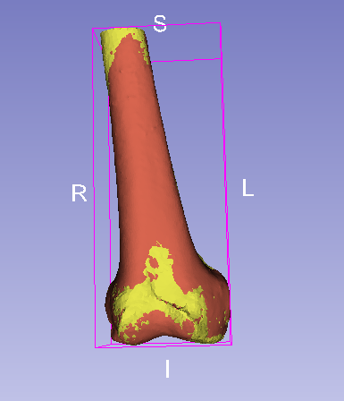
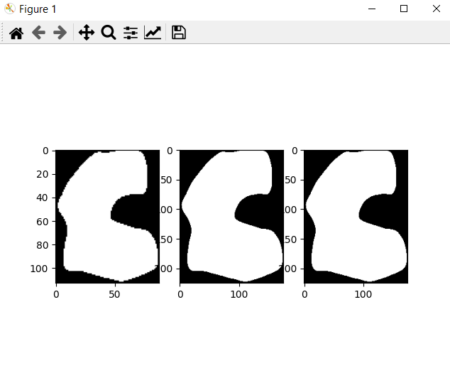
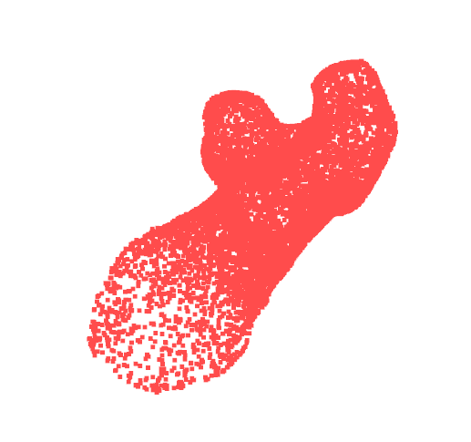

<p align="left">
  
</p>

# STL-NIfTI Toolkit

A lightweight toolkit for converting, transforming and processing STL and NIfTI files in orthopedic research.

## Features
- 🔄 Convert STL to NII file (NIfTI) so that volumetric rendering could work better:
<div style="display: flex; gap: 10px;">
  
  
</div>

- 📐 find rigid transformations of STL and NIfTI models using cloud point ICP method.

<div style="display: flex; gap: 10px;">
  
  
</div>

- 🔻 Downsample or resample NIfTI files to target resolution to save storage

e.g. using only voxels with values; compressing from 200MB --> 20MB 

<p align="left">
  
</p>

-  Statistical Shape Modelling (SSM) of your target anatomies:

from left to right: mean shape, 1sd shape, -1sd shape, random shape;
<div style="display: flex; gap: 10px;">
  
  
  
  
</div>


- 🦵 Compatible with femur/tibia/prosthesis pre-op & post-op data
- 📦 Lightweight and easy to use

## Installation
```bash
pip install -r requirements.txt
