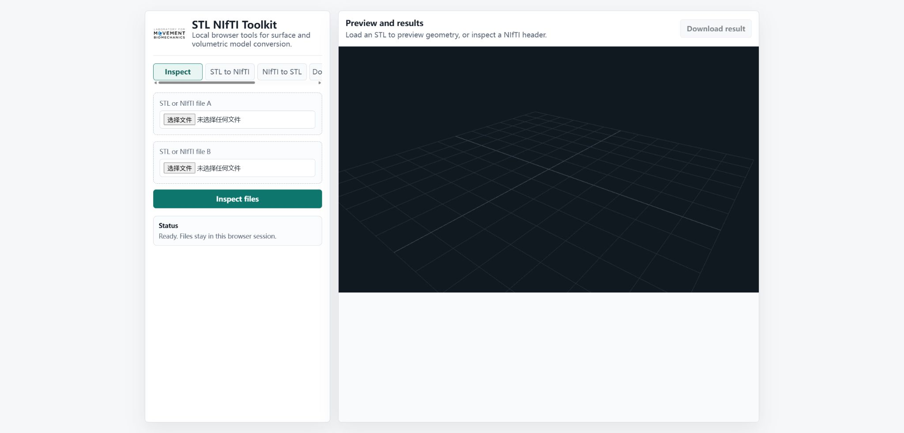
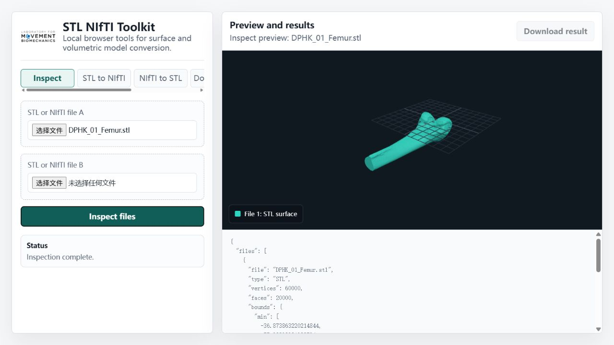
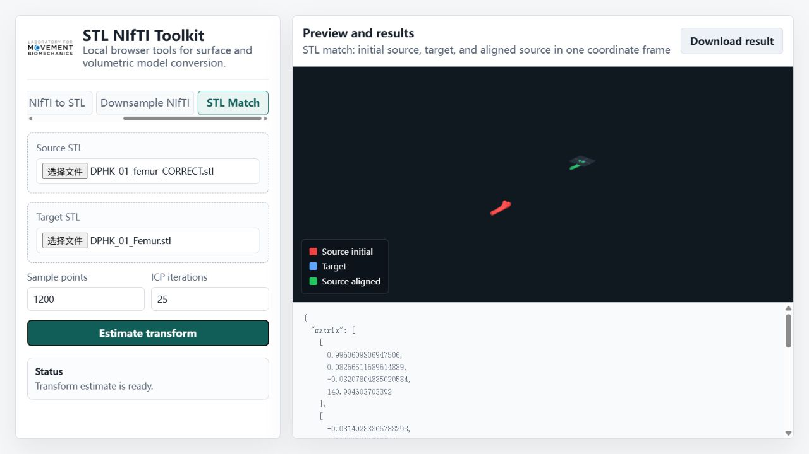

<p align="left">
  
</p>

# STL-NIfTI Toolkit

A lightweight research toolkit for converting, inspecting, transforming, and processing STL and NIfTI files in orthopedic and medical-imaging workflows.

You can use the toolkit in two ways:

1. **Use the online web app** for quick, installation-free processing in your browser.
2. **Use the Python research code** when you need to adapt the workflow, process larger datasets, or integrate it into a research pipeline.

## Online web app

### [Open the STL-NIfTI Toolkit on Jinhao Lab](https://jinhaolab.com/tools/stl-nifti/)

The web app runs locally in your browser session. Selected STL and NIfTI files are processed on your device and are not uploaded to a server.

It currently provides:

- STL and NIfTI header and geometry inspection.
- STL to uncompressed `.nii` voxelization with configurable voxel size and HU value.
- NIfTI thresholding and block-surface binary STL export.
- NIfTI cropping, resampling, and downsampling.
- Lightweight STL-to-STL rigid transform estimation with browser-side ICP.
- Interactive Three.js previews and downloadable results.

### Web interface



### Inspect STL geometry in the browser



### Estimate and inspect an STL rigid transform



## Python research code

The [`stl_nii_toolkit`](stl_nii_toolkit) directory contains the original Python research workflows:

- [`converters.py`](stl_nii_toolkit/converters.py) — STL voxelization and NIfTI generation using VTK and NiBabel.
- [`transforms.py`](stl_nii_toolkit/transforms.py) — rigid STL registration and transform application using Open3D ICP.
- [`downsample.py`](stl_nii_toolkit/downsample.py) — NIfTI cropping and resampling experiments using NiBabel and Nilearn.
- [`utils.py`](stl_nii_toolkit/utils.py) — STL compression, comparison, coordinate checks, and NIfTI utility workflows.

Clone the repository to inspect or adapt these workflows:

```bash
git clone https://github.com/wjh19990923/STL-NIfTI-Toolkit.git
cd STL-NIfTI-Toolkit
```

The Python files are research-oriented scripts rather than a finished PyPI package. Some workflows depend on project-specific modules, local paths, and scientific Python libraries, so review the imports and configuration in the relevant script before running it on your data.

## Research workflow examples

### STL to NIfTI conversion

The toolkit can voxelize an STL anatomy to create a NIfTI volume for volumetric rendering and downstream registration workflows.

<div style="display: flex; gap: 10px;">
  
  
</div>

### Rigid model registration

Rigid transformations between STL models can be estimated with point-cloud ICP and inspected against the expected alignment in medical-imaging software.

<div style="display: flex; gap: 10px;">
  
  
</div>

### Additional workflows

- Downsample or resample NIfTI files to reduce storage and processing requirements.
- Work with femur, tibia, and prosthesis models from pre-operative and post-operative datasets.
- Inspect geometry, affine orientation, voxel spacing, bounds, and registration residuals.

## Run the web app locally

The browser app is static and can be served directly from the repository root:

```bash
python -m http.server 8087
```

Then open [http://127.0.0.1:8087/index.html](http://127.0.0.1:8087/index.html).

## Validation note

The browser implementation is intended for lightweight preprocessing, demonstrations, and small-to-medium files. For publication-grade conversion or large clinical CT volumes, validate results against the Python/VTK/Open3D workflow and keep affine orientation, voxel spacing, fill strategy, intensity scaling, and registration residuals under explicit quality control.

## License

See [`LICENSE`](LICENSE).
