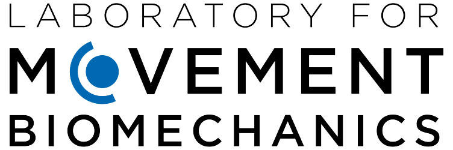
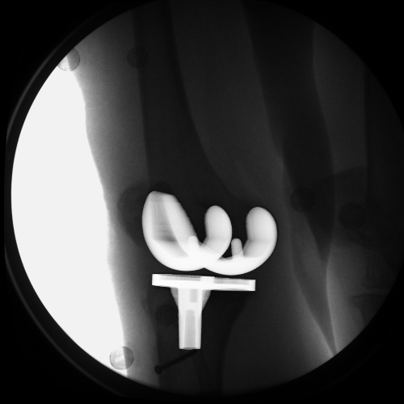
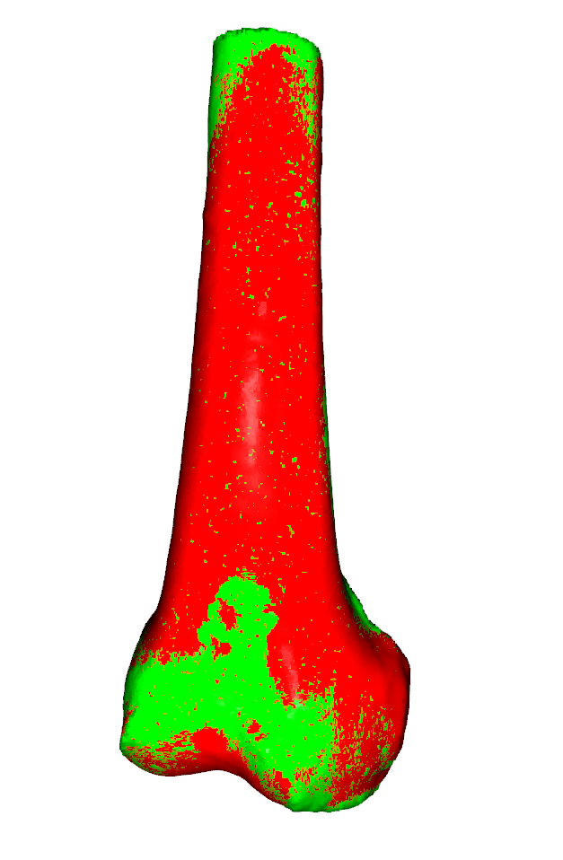
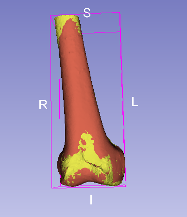

<p align="left">
  
</p>

# STL-NIfTI Toolkit

A lightweight toolkit for converting, transforming and processing STL and NIfTI files in orthopedic research.

## Features
- 🔄 Convert STL to NII file (NIfTI) so that volumetric rendering could work better:
<div style="display: flex; gap: 10px;">
  
  
</div>

- 📐 find rigid transformations of STL and NIfTI models using cloud point ICP method.

<div style="display: flex; gap: 10px;">
  
  
</div>
- 🔻 Downsample or resample NIfTI files to target resolution to save storage

- 🦵 Compatible with femur/tibia/prosthesis pre-op & post-op data

- 📦 Lightweight and easy to use

## Installation
```bash
pip install -r requirements.txt
```

## Web app

This repository also includes a static Netlify-ready browser app:

```bash
python -m http.server 8087
```

Then open `http://127.0.0.1:8087/index.html`.

The web app keeps files local in the browser session and currently supports:

- STL and NIfTI header/geometry inspection.
- STL to uncompressed `.nii` voxelization with configurable voxel size and HU value.
- NIfTI threshold to block-surface binary STL export.
- Lightweight STL-to-STL rigid transform estimation with browser-side ICP.

The browser implementation is intended for lightweight preprocessing, demonstrations, and small-to-medium files. For publication-grade conversion or large clinical CT volumes, validate against the Python/VTK/Open3D workflow and keep affine orientation, voxel spacing, fill strategy, and registration residuals under explicit quality control.
